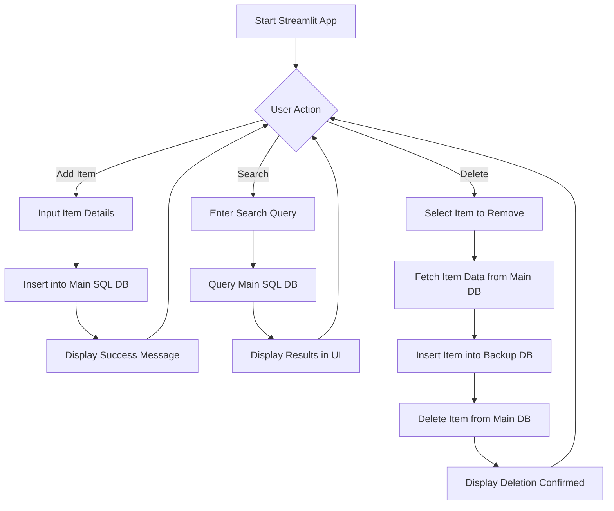

# SQL Inventory System

This tool mainly focus on streamline inventory and tracking of parts, materials, price, and selling price. The main feature of this is its web-based functionality that can be access easily. Which has additional feature of backing up the specific data when deleted.

### What's great about this?
- ⭐ Easy to access
- ⭐ Web-based feature (great for simultaneuous usage)
- ⭐ Minimal design with no additional bloated features
- ⭐ Use SQLite as its database with easiness to modify
- ⭐ Backup the deleted data with another database

#### Streamlit Preview - Add Item


#### Streamlit Preview - Search Item


### Structure Design


### How to use?

1. Enable environment
```bash
py -m venv .venv
```
```bash
.venv\Scripts\activate
```
2. Requirements installation
```bash
pip install -r requirements.txt
```
3. Run the program using streamlit
```bash
streamlit run app.py
```
4. Check this out
```bash
https://sql-inventory-system.streamlit.app/
```

---
##### Enjoy using SQL Inventory System - Streamlit