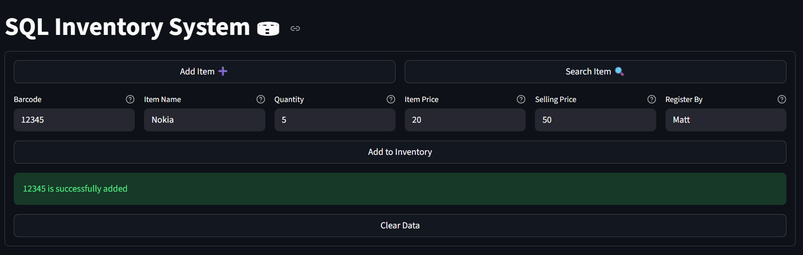
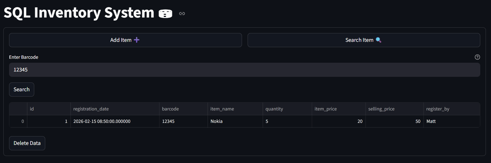

# SQL Inventory System

This tool mainly focus on streamline inventory and tracking of parts, materials, price, and selling price. The main feature of this is its web-based functionality that can be access easily.

### What's great about this?
- ⭐ Easy to access
- ⭐ Web-based feature (great for simultaneuous usage)
- ⭐ Minimal design with no additional bloated features
- ⭐ Use SQLite as its database with easiness to modify
- ⭐ Backup the deleted data with another database

#### Streamlit Preview - Add Item



#### Streamlit Preview - Search Item



### How to use?

1. Enable environment
```bash
> py -m venv .venv
```
```bash
> .venv\Scripts\activate
```
2. Requirements installation
```bash
pip install -r requirements.txt
```
3. Create '.env' file and store the SQLite path
```bash
DATABASE_PATH = "sqlite:///db/database.db"
BACKUP_DATABASE = "sqlite:///db/database.db"
```
4. Run the program using streamlit
```bash
streamlit run app.py
```
5. Check data on database

---
##### Enjoy using SQL Inventory System - Streamlit